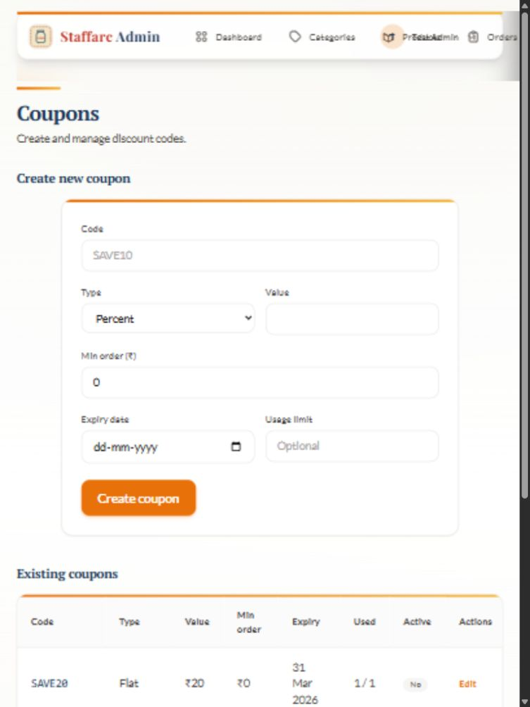
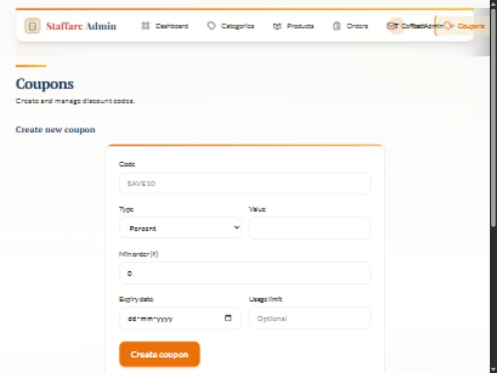
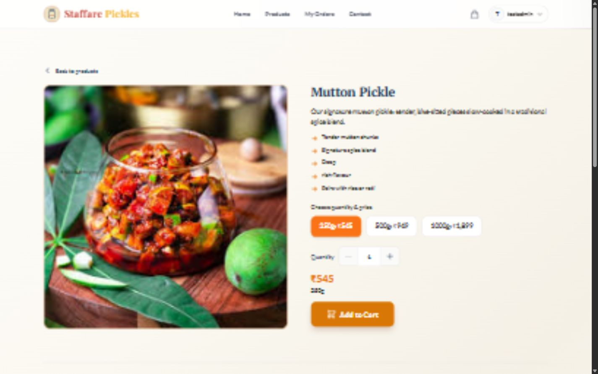

# Admin panel QA report

Test date: 5 October 2026 (Asia/Calcutta)
Site: https://www.yourbusiness.live/admin

## Verdict

The admin pages load and the checked read-only functions work, but the panel is **not fully working across screen sizes**. The main defect is clipped and overlapping navigation on tablet and small-laptop widths. There are also accessibility, input-validation, and product-highlight formatting issues.

No existing data was deleted or changed. No records were created. Existing edit forms were opened and cancelled; no Save, Update, Delete, image removal, stock change, or coupon activation was submitted. The session was signed out at the end.

## Coverage and results

31 distinct admin routes were opened: Dashboard, Categories, Products, Add product, all 24 existing product editors, Orders, Contact, and Coupons.

| Area | Result | What was verified |
|---|---|---|
| Login | Pass | Provided admin account signs in and reaches Dashboard. |
| Dashboard | Pass at desktop/phone; header defect at tablet | Four management cards and navigation render. Products card navigation exercised. Categories is available in navigation. |
| Categories | Pass for inspected functions | Four records loaded; all four edit dialogs opened with matching values and cancelled. Empty Add category submission blocked by required Name. |
| Products list | Pass | All 24 products loaded. Filters returned Chicken 8, Fish 4, Mutton 8, Prawn 4, All 24. Search for tuna returned one result; a deliberately unmatched term returned the appropriate empty state. |
| Add product | Partial pass | Form opens; empty Create product submission blocked by required Name. Saving and uploads intentionally untested. |
| Product editors | Pass for reading | All 24 editors loaded names and three price variants. No saves submitted. |
| Orders | Empty state works | Table headings and No orders yet displayed. No existing order was available to test details, tracking, or status changes. |
| Contact | Pass for read/manual refresh | Two messages displayed; Refresh now completed and returned to its ready state. Delivery of new live messages was not tested. |
| Coupons | Pass for reading/dialogs | Five records loaded; all five edit dialogs opened with matching codes and cancelled. Empty Create coupon submission blocked. Numeric validation concerns listed below. |
| Store link | Pass | Admin Store navigation opened the storefront. A product page was inspected to verify the highlight issue below. |
| Sign out and route guards | Pass at UI level | Sign out returned to the store. All eight sampled admin page types then redirected to login with the appropriate next path. This does not establish API-level authorization security. |

## Responsive testing

All eight admin page types were checked at 320×568, 390×844, 768×1024, and 1440×900. The shared header was additionally inspected at 1024×768. This was browser viewport testing, not testing on physical devices or across Safari/Firefox.

| Viewport | Result |
|---|---|
| 320×568 | Page widths fit. Mobile menu available. Coupon dialog scrolls internally and Cancel remains reachable. |
| 390×844 | Mobile menu opens and closes on navigation. Dashboard cards, product filters/grid, and form layouts fit. Wide tables scroll within their containers. |
| 768×1024 | **Fail: shared desktop header overflows/clips and overlaps the account control.** Main page bounds still fit, so a page-width-only test would miss the defect. |
| 1024×768 | **Fail: header links overlap the account control; rightmost navigation is clipped.** Shared header only checked at this additional size. |
| 1440×900 | Full navigation fits; all eight page types load without document-wide horizontal overflow. |

On phones the Orders and Contact tables have a 640px minimum rendered width and Coupons a 720px width, inside horizontally scrollable containers. That is contained table scrolling, not document overflow.

## Findings and reproduction steps

### 1. High priority — tablet/small-laptop navigation is clipped and overlaps

Affected: shared admin header, demonstrated on Coupons.

Reproduce: sign in, open Coupons, set viewport to 768×1024 or 1024×768.

At 768px, Contact begins around x=770, Coupons around x=887, and Store around x=1010, beyond the viewport. The account menu overlaps the visible product navigation. At 1024px it overlaps the Contact/Coupons area. The mobile Menu control is not offered at these widths.

Expected: every navigation destination is reachable without overlap, preferably by keeping the mobile menu until all desktop items fit.

Suggested fix: move the desktop-navigation breakpoint upward, or use an overflow menu and flex constraints that reserve room for the account button. Verify both widths after changing it.

### 2. Medium priority — product and coupon fields lack accessible labels

Affected: Add/Edit product and Create/Edit coupon forms; product search also has no accessible name in the accessibility tree.

Observed: product Name, Slug, Description, Highlights and variant inputs appear as unnamed controls. Inspected inputs have no associated labels and no aria-label; coupon numeric inputs likewise have no associated labels. Visible text beside a field is not programmatically connected to it.

Expected: assistive technology announces each field's purpose, including variant row and price.

Suggested fix: associate visible labels using matching for/id values or a wrapping label; label search and repeated variant controls distinctly.

### 3. Medium priority — category and coupon dialogs lack normal keyboard behavior

Reproduce: open a category or coupon Edit dialog. Opening leaves focus on the background Edit button. Press Escape inside the dialog: it remains open. Focus Save changes and press Tab: focus moves outside the dialog to the page body.

Expected: focus enters the dialog, stays inside while open, Escape dismisses, and focus returns to the opener on closing.

Cancel worked for every tested record; coupon Close also worked. This is a keyboard/accessibility defect rather than a failure to open or cancel with the mouse.

Suggested fix: use a dialog component with focus management, trapping, restoration, background inertness, and Escape handling.

### 4. Medium priority — missing browser-side coupon value bounds

Reproduce: in Create coupon with Percent selected, enter 101 in Value, then -5. Both values are reported valid by the input's browser validity state. The discount input has neither min nor max; minimum-order and usage-limit inputs also lack bounds.

**Scope:** these values were never submitted. Server rejection or acceptance remains unverified; this is a confirmed frontend validation gap, not proof that invalid coupons can be saved or redeemed.

Suggested fix: enforce meaningful numeric bounds in the form and server. Percentage should stay within the intended 0–100 policy; flat discounts/minimum orders should be nonnegative; usage limits should follow a positive-integer policy when supplied.

### 5. Low priority — highlight delimiters break natural product text

Affected example: Mutton Pickle.

The saved admin Highlights value reads: Tender mutton chunks;Signature spice blend;Deep, rich flavour;Pairs with rice or roti. The helper text says Comma-separated, while existing values use semicolons. The storefront renders Deep and rich flavour as two separate bullets.

Expected: Deep, rich flavour stays one bullet and the editor describes the actual format.

Suggested fix: store highlights as structured items, or use a single documented delimiter that preserves normal punctuation. Review existing values before migration.

## Additional observations

- One captured browser warning reported a CatalogRealtimeListener CHANNEL_ERROR. The inspected pages continued to load. This suggests checking subscription/reconnect handling, but does not by itself prove live updates are broken.
- Several expired coupons still show Active: Yes. That may represent an enabled flag independently of expiry. A separate Expired status would make the table clearer; checkout enforcement was not tested.
- All listed product thumbnails use the same underlying image asset. The visible thumbnails loaded; this may be intentional sample content.

## Limits of this audit

This was a preservation-first review of the live UI. Create/update/delete persistence, product upload/removal, stock changes, coupon activation/redemption, checkout/payment, notification delivery, and populated order workflows were not exercised. There were no orders to inspect. No automated security scan, API authorization test, load test, measured performance benchmark, or multi-browser/device test was performed. No blanket claim that every function works is warranted.

The JSON evidence file records the responsive measurements, product-page coverage, filter counts, dialog records, and logged-out redirects. It contains no login password.

Recommended order of fixes: navigation breakpoint first, accessible labels and dialog keyboard behavior next, then numeric validation and highlight formatting.
